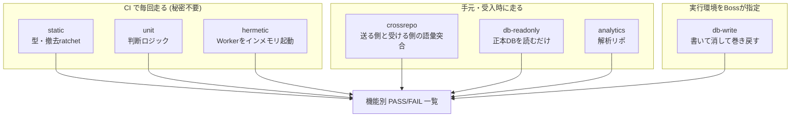

# CDPテストプラン — 機能一覧・合格基準・テスト対応表

**一言で** — 顧客データ統合 (CDP) で作った42の機能を利用者視点で列挙し、各機能の「何が確認できれば動作証明か」を決め、既存・新規のテストを紐づけて1コマンドで回せるようにしたもの。

**結論・状態** — `pnpm test:cdp:acceptance` で42機能 / 25検査が機能IDごとにPASS / FAILで出る。全層を揃えた初回フル実行は **42/42 PASS**。CI (静的・単体・ハーメティックの3層) には1ステップで組み込み済み。

**Ask** — 共有 (FYI)。機能を足すときは本書 §5の手順に従って `tests/cdp-acceptance/features.json` に1行足す。

**正本の関係**: 設計 = [統合設計 (最終案)](../../../../circl/agents/circl-boss/deliverables/cdp-design-final-20260828.md) / 挙動の契約 = [`cdp-events-gateway-contract.md`](./cdp-events-gateway-contract.md) / **機能と合格基準 = `tests/cdp-acceptance/features.json`（機械可読の正本）** / 本書 = その読み方と設計判断。値は二重に持たない — 機能の一覧はfeatures.jsonが正本で、本書はそれを説明する。

---

## 1. なぜ機能別のテストが要るのか

**結論: テストは7つの層に散っていて、「どの機能が緑なのか」を誰も言えない状態だったため。**

CDPの検査資産はStage 0〜4を通じて充実している（本書作成時点で25検査・のべ200以上のassert）。しかし走らせ方は層ごとにばらばらで、

- `pnpm test:unit` … 60本以上の単体を1本の連結コマンドで回す
- `pnpm test:hermetic` … vitest
- `pnpm test:db:cdp*` … 5本が別々のスクリプト
- 解析リポ (`elxea-cdp`) … `node --test`
- 送る側 (`elxea-web-app`) … vitest（別リポジトリ）

全部走らせても、出てくるのは**テストの言葉**の結果である。「連携済みの人のLINE会話が統合ビューに出るか」という**機能の言葉**の問いには答えられない。テストファイル名と機能は1対1ではないからで、たとえば ★11 (会話の断線) の証明は単体・DB・ハーメティックの3層に分かれて置かれている。

本スイートは機能の言葉への翻訳表を持ち、翻訳表を正本にして走らせる。

### 汎用テストプランとの関係

共通スキル `test-planning` (8観点 + 状態遷移マトリクス + 突合表) を土台に採用する。本スイートは同スキルの**工程3「突合」を機械化したもの**にあたる — 判定語 (Covered / Uncovered) をPASS / SKIP / GAPに対応させ、突合表を人手の表ではなく実行可能な形にしてある。

汎用プランでは足りず、CDP固有として足した観点は4つ:

| 固有観点 | なぜ汎用では足りないか |
|---|---|
| **追記専用の不変性** | 「書き換えられないこと」は成功時に何も起きない。普通のテストは成功経路しか踏まないので、守りが消えても緑のまま |
| **消去との対称性** | 「消える」の正しさは *列挙が置き場を取りこぼしていないか* に依存する。個別の表を検査しても、列挙から漏れた表は検査対象にすら入らない |
| **同意ゲート** | 記録しないことが正しい挙動。「何も起きなかった」を検査しないと、同意が壊れても誰も気づけない |
| **チャネル横断の一致** | 送る側と受ける側が別リポジトリにある。片側だけのテストは、片側の自己整合しか言えない (D3 / D4が実際にこの形で壊れた) |

---

## 2. 検査の7層 — 何をどこで確かめるか

**結論: 「実物に在るか」「どう振る舞うか」「本当に書けて消せるか」を別々の層が持つ。1層では足りない。**



| 層 | 何を確かめる | 前提 | CI |
|---|---|---|---|
| `static` | 型が通る / 撤去の進捗が両方向ratchetで固定されている | なし | ○ |
| `unit` | ネットワークもDBも無い所で決まる判断 (冪等キーの作り方・語彙判定・除外の効き方・失敗の読み替え) | なし | ○ |
| `hermetic` | Workerをworkerd内に立てて実際に叩く。応答・分岐・L0に積まれた行 | なし | ○ |
| `crossrepo` | 送る側 (web-app) が送る語彙を、受ける側が全部受理するか | `ELXEA_WEB_APP_PATH` か隣接配置 | × |
| `db-readonly` | **正本のDBに配線が実在するか** (トリガ10本・一意制約・SQL関数17本) + 実データが不変条件を守っているか | `SUPABASE_URL` / `SUPABASE_DB_PASSWORD` | × |
| `db-write` | 書いて消して巻き戻す往復 (追記専用の両方向・消去の到達・復活しないこと) | `CDP_DB_TARGET` | × |
| `analytics` | 解析側の取り込み冪等・消去の到達・3指標 | `ELXEA_CDP_PATH` か隣接配置 | × |

### 接続先の方針 (2026-08-30の運用変更を反映)

**stagingは凍結され、本番が正本になった**（未リリース状態なので本番が唯一の実物）。これを受けてDB系の検査を2つに割った。

- **既定は本番・読み取り専用**。`tests/db/lib/cdp-db-target.ts` の `connectReadOnly` が接続直後に `default_transaction_read_only = on` を張るので、書き込みSQLはPostgres側が25006で拒否する。「気をつけて書かない」ではなく**書けない**。
- **書込を伴う検査は本番では走らない**。`connectWritable` がprodを拒否し、理由を出してSKIP終了する (exit 0)。落とさないのは「書ける環境が無い」と「検査が落ちた」を区別するため。
- **どの環境で書込検査を回すかは、実行時にBossが `CDP_DB_TARGET` で指定する**。既定値としてどこかを埋め込まない。

読み取りだけでも確かめられることは多い。migrationの当て忘れは「何も壊れず、ただ守りが無い状態」を作るいちばん静かな壊れ方で、これは読むだけで捕まえられる。

---

## 3. 機能インベントリと合格基準

**結論: 42機能・6領域。合格基準はfeatures.jsonの `criteria` が正本。**

以下は領域ごとの要約。機能IDと合格基準の全文は `tests/cdp-acceptance/features.json`、一覧表示は `pnpm test:cdp:acceptance:list`。

### 事実の収集 (L0) — F-01〜F-09

出来事を書く口を1本に寄せ、知らない出来事も捨てず、二重に数えず、積めなかったら理由を残す。生の識別子をL0に置かない。口は鍵なしで開かない。アンケートと診断の答えも同じ口へ流れる。送る側と受ける側の語彙が食い違わない。

### 人の同一性 — F-10〜F-18

匿名の1歩目から主体 (`subject_id`) を発行し、1つの鍵は1人にしか結ばない。連携は既存行の書き換えではなく追記1行。メール等値では人を結ばない (SEC-1)。1人に2本目のLINEを結ばない (J-4)。連携済みの人のLINE会話が統合ビューに出る (★11)。コード導入以前に成立していた連携も写し取れる。

### 解釈 (L1) — F-19〜F-21

カルテを1冊にし、L0から全再計算できる。「もういらない」と安全に関する申告は点数で覆らない。期間別の内訳は暦の月 (JST) で切る。

### 配信 — F-22〜F-24

宛先をSQL 1本で出す (全件スキャン3本の置き換え)。shadowは配信の挙動を1つも変えず、cdpモードは引けなければ送らない (fail-closed)。未連携の人にも宛先が立つ。

### 解析 — F-25〜F-30

解析がL0を取りに来る3つの口。鍵なしで開かない。日の境界はJST。取り込みは冪等。2つのL0が同じ数を持つ (E8')。3指標がL0から出る。

### 消去 (GDPR) — F-31〜F-36

**消去の正しさは3段構えで確かめる。**

1. **列挙が置き場を取りこぼしていないか** (F-31) — 人を指していそうな列を*わざと広い網*で拾い、拾った表がすべて「消去の列挙に載っている」か「載せない理由が宣言されている」かのどちらかであることを要求する。どちらでもない表が1つでもあれば落ちる。
2. **列挙されたすべての置き場から本当に消えるか** (F-32・F-36) — 表名をテストに書き写さず、列挙を駆動側にして残渣を数える。書き写すと、書き写した表しか見なくなる。
3. **消したあと復活しないか** (F-34) — 退役した主体には出来事・鍵・解釈を足せず、同じ冪等キーで来ても新しい主体に付く。

### 機械強制・観測 — F-37〜F-42

未設定なら起動を拒否する (E6')。撤去の進捗が両方向ratchetでCIに固定されている (R8)。設計が要求する配線が正本のDBに実在する。新旧一致の観測が空虚合格しない。正本のデータ自体が不変条件を守っている。型が通る。

---

## 4. 実行方法

```bash
# 走れる層を全部走らせる (既定)
pnpm test:cdp:acceptance

# CI と同じ 3 層だけ
pnpm test:cdp:acceptance:ci

# 機能一覧だけ見る (走らせない)
pnpm test:cdp:acceptance:list

# 全層を揃えて回す (受入時)
ELXEA_WEB_APP_PATH=../elxea-web-app \
ELXEA_CDP_PATH=../elxea-cdp \
CDP_DB_TARGET=<書ける環境> \
  pnpm test:cdp:acceptance

# 1 機能だけ / 未カバーも落とす / 機械可読
pnpm test:cdp:acceptance -- --feature=F-32
pnpm test:cdp:acceptance -- --strict
pnpm test:cdp:acceptance -- --json
```

### 判定の読み方

| 判定 | 意味 | 終了コード |
|---|---|---|
| `PASS` | 紐づく検査がすべて通った | 0 |
| `FAIL` | 1つでも落ちた | **1** |
| `PARTIAL` | 通ったものと、前提が無くて走れなかったものが混在 | 0 (`--strict` で1) |
| `SKIP` | 紐づく検査が1つも走れなかった | 0 (`--strict` で1) |
| `GAP` | 紐づく検査が0件 = 未カバーの申告 | 0 (`--strict` で1) |

**走れなかったことをPASSに混ぜない。** 混ぜると「CIで緑なのに何も検査していない」が起きる。これは検査を持たないのと同じで、いちばん静かに壊れる。

---

## 5. 機能を足すときの手順

1. `tests/cdp-acceptance/features.json` の `features` に1行足す (`id` / `area` / `name` / `criteria` / `checks`)。
2. 検査がまだ無ければ `checks` を空配列にして足す → 判定が `GAP` になり、表に「未カバー」として出続ける。**隠せないようにしてある。**
3. 検査を書いたら `checks` の登録簿に1行足し、機能から参照する。
4. 参照の健全性 (存在しない検査ID・存在しないtier) は起動時に検査され、壊れていればexit 2で止まる。

実行器 (`scripts/ops/cdp-acceptance.mjs`) には機能名を1つも書かない。書くと足し忘れが表に出なくなる。

---

## 6. CIへの組み込み

**結論: 既存の `hermetic-e2e` ジョブに1ステップ足しただけ。新規ジョブ・新規cronは作らない。**

CIで走らせるのは秘密を必要としない3層 (`static` / `unit` / `hermetic`) に限る。DB・別リポジトリを要する層は `--tier` で除外され、判定は `PARTIAL` / `SKIP` になるがCIは落ちない。

この配置には理由がある。CIを落とす条件は「PRが壊した」に限りたい。秘密や隣のリポジトリが無いことはPRの責任ではないので、それで赤くすると赤の意味が薄まり、やがて誰も見なくなる。

DB層・解析層・2リポ突合は**受入時に人が回す**。統合設計 §6-1の各段の完了条件はもともと人が判断する形で書かれており、その判断材料としてこのスイートを回す。

---

## 7. 本スイートで見つかった問題 (初回構築時)

**結論: 3件。うち2件は「検査が存在するのに走っていなかった」形の穴。**

| # | 見つかったもの | 深刻度 | 処置 |
|---|---|---|---|
| 1 | **CDPのHTTPの口4つに認証の検査が1つも無かった** — `POST /api/events` とL0読み口3本。認証を外してもどのテストも赤くならない状態だった (認証の穴は成功時に何も起きないので、誰も401を見ない) | 高 | `tests/hermetic/flow20-cdp-http-surface.test.ts` を新設 (17検査)。認証を素通しに変異させると17件中13件が落ちることを実測済み |
| 2 | **消去の対称性テスト `roji-erasure.db.test.ts` が壊れたまま放置されていた** — `package.json` に登録が無く (orphan)、migration 039で廃止された `customer_profiles` を参照して即死していた。「どのIDから消しても結果が同じ」(F-36) が誰にも検査されていなかった | 高 | 廃止表への参照を除去し、`test:db:erasure` として登録。受入スイートに接続 |
| 3 | **「消去の列挙が置き場を取りこぼしていないか」を見る検査が無かった** — 個別の表を消せることは検査されていたが、列挙から漏れた表は検査対象にすら入らない。設計 §3-3のR10' (b)(c) が未実装だった | 高 | `tests/db/cdp-invariants-readonly.db.test.ts` を新設 (45検査)。広い網の国勢調査 + 配線の実在確認。**この検査自身が構築中に1件の死蔵申告を検出した** (`broadcast_stats` — 実表が存在しない) |

---

## 8. 残る空白 (明記)

**結論: 3つ。いずれも「今は埋められない」理由がある。**

1. **同意ゲートの強制は送る側にしかない** — `web_anonymous_id` を同意なしで送らないのはweb-app側の判断で、受ける側 (gateway) は同意状態を知らない。受ける側に持たせるには「同意をCDPが保持する」という設計変更が要るため、本スイートでは *送る側が同意なしに送らないこと* をcrossrepo層で押さえるに留めている。設計判断が要る事項として残す。
2. **解析リポ (`elxea-cdp`) にlint / CIの機械強制が届かない** — 統合設計 §9が「未解決」と明記した空白そのもの。本スイートは `analytics` 層で*観測*を届かせたが、旧経路の再生を止める歯は無い。
3. **デプロイ済みWorkerに対するHTTP E2Eは持たない** — staging凍結に伴い、Workerを実際に立てて叩く経路は `hermetic` 層 (workerdインメモリ) が代替している。デプロイ後の検証は既存の `staging-webhook-contract` ジョブと同じ形で別途持つべきだが、本スイートの射程外とした。

---

## 9. 初回フル実行の結果 (2026-08-30 JST)

7層すべてを揃えた実行:

```
層の実行可否: static / unit / hermetic / crossrepo / db-readonly / db-write / analytics = 全 7 層 [実行]
検査 25 件: 全件 PASS
合計 42 機能: PASS 42 / PARTIAL 0 / SKIP 0 / GAP 0 / FAIL 0
```

正本DB (本番・読み取り専用) の観測値も同時に記録される。CDPの置き場はまだほぼ空 (`customer_events` 0行) であり、**本番での動作証明は現時点では構造的なもの**である点は明記しておく。挙動の証明はハーメティック層と書込層が担う。この非対称は未リリース状態に由来し、リリース後に本番の実データが積まれれば `db-readonly` 層のF-41 (実データの不変条件) が実質的な意味を持ち始める。

---

作成: elxea-developer / 2026-08-30 JST
