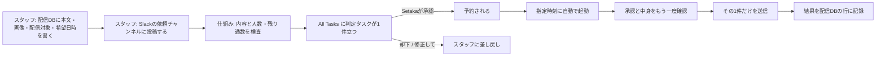

# LINE配信のつくりかた（運用者ガイド）

このガイドは、パソコンの専門知識がなくても、Notion の画面だけで LINE のお知らせを出すためのものです。

> **このファイルとNotion版の関係**: 運用者が読むのはNotion版
> （<https://app.notion.com/p/39970c9d064c81dabf04f65c073d667c>）です。本ファイルはリポジトリ側の写しで、
> **配信まわりのコードを変えたときは、このファイルとNotion版を必ず同時に直します**。
> エンジニア向けのコマンド・設定の詳細は、このページの末尾「運用者（エンジニア）向け」節にあります。

---

## いまの状態（最初に必ず読む）

| 項目 | いまの状態 | 意味 |
|---|---|---|
| 配信を頼む人 | **スタッフ** | 配信DBに本文・画像・配信対象・希望日時を書き、Slack の依頼チャンネル（#line-haishin-irai）に投稿して「依頼」します |
| 承認する人 | **Setakaだけ** | All Tasks に立つ「判定タスク」で承認します。ほかの人は承認できません |
| Status を「Approved（承認）」にするのは | **仕組み（機械）** | **スタッフは Approved にしません。**手で入れても送信には使われません |
| 送るきっかけ | **依頼で指定した日時**（自動） | 指定時刻に機械が起動します。AI（LLM）は使いません |
| 練習・テストの場所 | **検証環境（テスト用LINE @426vlcyb）** | 検証環境でもテスト用LINEの友だちに本当に届きます |

> **いまの状態の注記（2026-09-25 時点）**: 新しい仕組みは本番に入りました。ただし、**本番のお客さまへの配信は、まだ始まっていません。**
> 本番の配信を始めるのは、Slackの依頼チャンネルを本番に切り替えたあとです（10/1の購買botの判定より後）。
> それまでは、依頼チャンネルに投稿しないでください（Setaka に頼まれたときを除きます）。投稿しても、お客さまには届きません。
> 始まるときは、Setaka がこの注記を消してお知らせします。

**旧運用（承認してから Setaka がエージェントに「配信して」と言う方式）は、2026-09-25 に終わりました。**
承認済みの行をまとめて送る口そのものを、本番から取り外しました。
以後は「スタッフが Slack で依頼 → Setaka が承認 → 指定時刻に1件ずつ自動配信」の1本だけです。

**いま人が手で Approved にしても、その行は送られません。** 送信の対象になるのは「依頼として受け付けられ、
Setakaが判定タスクで承認したもの」だけです。

---

## 新しい流れ（全体像）



---

## スタッフの手順

### ① 配信DBに行を作って中身を書く

Notion の「配信コンテンツ」を開き、上のタブから **「かんたん配信（運用者用）」** を選んで、
いちばん下の「＋ 新規」で行を1つ作ります。
（「【サンプル】使い方の見本」の行は書き方のお手本です。消さずに置いておいてください。）

書く欄は5つだけです。

- **配信タイトル**：あとで自分が見分けるための名前です（例：「夏の新作のお知らせ」）。お客さまには届きません。
- **本文**：LINE で送りたい文章そのものです。ここに書いた内容がそのまま届きます。
- **画像**：送りたい写真を欄にドラッグ＆ドロップします。写真がなければ空のままでOKです。
- **配信対象**：だれに送るかを選びます（全員 / 癒し / 探求 / 味覚 / 社内）。**空のままにしないでください。**
- **配信予定日時**：**出したい希望日時**を入れます。Slack で依頼するときの日時と合わせてください。違っていたときは、**Slack に書いた日時で送られます**。

> **⚠ 飾り記号は使わないでください。** LINE は書いた文字を**そのまま**表示します。太字にするつもりで
> `**新作のお知らせ**` と書くと、お客さまの画面には `**新作のお知らせ**` と**アスタリスクごと**表示されます。
> 見出し記号（`#`）・箇条書き記号（`-` `*`）・リンク記法（`[表示文字](URL)`）も同じで、そのまま出ます。
> 強調したいときは改行と空行で区切る、URL はそのまま貼る（`https://...` と直接書く）でお願いします。

> **⚠ 写真は JPEG か PNG、10MB まで。** iPhone の HEIC 形式や大きすぎる写真は**依頼が受け付けられません**
> （お客さまに壊れた写真が届かないよう、仕組みが検査で止めます）。理由は配信DBの行の「エラー詳細」の欄に出ます。
> 写真を JPEG か PNG に保存し直してから、もう一度依頼してください。
> 複数枚入れると、**並べた順番のまま**お客さまに届きます。

### ② 依頼する（Slackの依頼チャンネルに投稿）

**依頼チャンネル**: elxea Slackの **#line-haishin-irai**（非公開・メンバー制）。
投稿できるのは、このチャンネルに招待されたメンバーだけです。入れてほしいときはSetakaに頼んでください。

いま依頼チャンネルは、テスト用LINEの試験に使っています。botの返事の送り先は「検証環境のアカウント（お客さまには届きません）」と出ます。本番の配信が始まるまでは、Setakaに頼まれたとき以外は投稿しないでください。

**手順**

1. 配信DBの行を開き、右上の「…」から「リンクをコピー」を選びます（ブラウザのアドレス欄のURLは使いません）。
2. #line-haishin-iraiに **新しい投稿として**、配信したい日時と行のリンクを書いて送ります。
   例: 「この行を9/27 10:00に配信してください」と書き、その下に行のリンクを貼る
3. すぐにbot（elxeaアシスタント。画面では「備品購買」と表示されることがあります）が、投稿への返信で「承りました」と返します。
   返信に書かれた **対象の行・配信の予定・送り先** が、思っていたとおりか確かめてください。
   対象の行は英数字で出ます。貼ったリンクの最後のほうにある32文字の英数字と同じかを見てください。
4. 中身の検査が終わると、botが「配信の下調べが終わりました。承認をお願いします」と返します。
   **これはSetakaへの承認のお願いです。スタッフは何もしません。** Approvedも入れません。
5. あとはSetakaの承認を待ちます。結果は配信DBの行で確かめます（下の ④）。

**書き方のきまり**

- 行のリンクは **1回の投稿に1つだけ** にします。2つ以上あると、どちらを送るか決められないので受け付けません。
- 日時は次のどれかの形で書きます: 「9/27 10:00」「9/27 10時」「2026/9/27 10:00」「明日10時」「今日15:30」。
  「来週」「そのうち」のような、幅のある言い方は読めません。
- **時刻は24時間の数字で書きます**（午後3時は「15:00」か「15時」）。「午後」「夕方」は読めません。「3時」と書くと午前3時と読まれます。
- **配信時刻は、日本時間の8:00〜21:00の間だけ受け付けます。**
- 過去の日時は受け付けません。**Setakaの承認が予定の時刻に間に合わないと、送られません。前の日までに依頼してください。**
- **同じ行は、同じ月（日本時間のカレンダーの月）に1回しか送れません。** 毎月のお知らせや訂正の配信は、新しい行を作って依頼してください。
- 投稿へのスレッドの返信は、依頼として読まれません（botも返事をしません）。直すときは、新しい投稿として最初から書きます。botの返事を引用して書き直すのも同じで、読まれません。

**botがこう返したとき**

| botの返事 | 意味 | すること |
|---|---|---|
| 承りました。配信の下調べを始めます。 | 受け付けました | 返事の中の行・日時・送り先を確かめる |
| ご依頼を読み取れませんでした。 | 行のリンクか日時が無い・読めない、または過去の日時 | 返事に書かれた「足りないもの」を直し、新しい投稿で依頼し直す。リンクが見つからないと言われたら、行の右上の「…」から「リンクをコピー」でコピーし直す |
| 同じご依頼を、すでに受け付けています。 | 24時間以内に、同じ行・同じ日時の依頼がもう一度来ました | 何もしない（二重には送られません） |
| 配信の下調べを始められませんでした。/ 配信の下調べが終わりませんでした。 | 検査で止まった（写真の形式・配信対象・残り通数など）か、仕組みの側で止まりました | 写真の形式（JPEGかPNG・10MBまで）・配信対象・残り通数を見直し、新しい投稿で依頼し直す。配信DBの行の「エラー詳細」に理由が出ていれば、それに従う。分からないとき・続くときはSetakaに伝える |

**投稿を直したり消したりしても、依頼は変わりません**

botが読むのは、最初に投稿した文だけです。

- 投稿をあとから **編集** しても、行や日時は変わりません。
- 投稿を **削除** しても、依頼は取り消されません。判定タスクもそのまま残ります。

**間違えたとき（行や日時を間違えた・やめたい）**

1. すぐSetakaに「◯◯（配信タイトル）の依頼を取り消してください」と **直接** 伝えます（依頼チャンネルに書くと、botが依頼として読もうとします）。
2. 判定タスクが立ったら、Setakaが「却下」にします。これで、その依頼は送られません。
3. 出し直すときは、正しい行・日時で、新しい投稿として依頼し直します。

出し直すのは、取り消しが済んでからにしてください。同じ行は同じ月に1回しか送れないので、間違った方が先に送られると、正しい方は送られません。

### ③ Status は触らない

**スタッフは「Status」を自分で変えません。**とくに **Approved（承認）にはしないでください。**
承認は Setaka が別の場所（All Tasks の判定タスク）で行います。
Status は、依頼が受け付けられたあと仕組みが自動で進めます。

### ④ 結果を確認する

送信が終わると、配信DBのその行が自動で更新されます（**Status・送信日時・通数**）。
スタッフはこの行で結果を確認してください。**送信の結果は Slack には出ません**（bot が返事をするのは、依頼を受け付けたときと、下調べが終わったときだけです）。

---

## やってはいけないこと

- **「Status」を自分で変えない**（とくにApprovedにしない）。人が入れたApprovedは送信には使われません。
- **Slackの依頼の投稿を編集・削除して、依頼を直そうとしない**でください（依頼は変わりません）。直すときは「② 依頼する」の「間違えたとき」のとおりにします。
- **依頼したあとに本文・写真・配信対象を書き換えない**でください。承認の前後どちらでも、書き換えると
  **送られなくなります**（安全のために止まります）。直したいときは、もう一度依頼し直してください。
- **タイトル・本文・画像・配信対象・配信予定日時 以外の欄はさわらない**でください。ほかの欄は仕組みが使う欄です
  （見えていない欄も含めて、そのままにしておいてください）。「エラー詳細」は**読むだけ**にしてください。
- **飾り記号（`**` `#` `-` など）を本文に書かない**でください（そのまま表示されます）。
- **本番の「配信コンテンツ」で練習しない**でください。練習は検証環境の表で行います（下の「テストしたいとき」）。

---

## 承認のしかた（Setaka）

1. 依頼が検査を通ると、**All Tasksに「判定タスク」が1件立ちます**。Setakaへの知らせはこれだけです
   （依頼チャンネルのbotの返事「承りました」「下調べが終わりました」は、スタッフへの受付の知らせです）。
2. 判定タスクには、**本文の全文・画像の枚数・配信対象・実際に届く人数・今月の残り通数・予定日時（日本時間）・中身の指紋**が
   並んでいます。**予定の時刻を過ぎてから承認すると送られません。**
3. 内容を確認して、**「判定」を「承認」にします**。スマホからでもできます。
   承認できるのは **Setaka だけ**です。Setaka が CIRCL の既定アカウントで承認します
   （照合に使うアドレスは Worker の secret `DELIVERY_OWNER_EMAIL` に保管。値はここに書きません）。
   ほかのアカウント（elxea 側のアドレスなど）での承認は無効になります。
4. 「却下」なら終了、「修正して」ならスタッフに差し戻されます。
5. 承認しないまま **7日**過ぎると、その依頼は失効します（スタッフが再依頼します）。

> **ほかの人が「承認」にしても送られません。** 仕組みは「判定が承認になったのを**初めて見た時点**で、
> そのときの編集者を記録して固定する」作りです。Setaka 以外だったら、その依頼はその場で無効になり、
> あとから Setaka が触っても復活しません（スタッフが再依頼 → Setaka が再承認）。

> **⚠ 承認したあとは、送信の記録が終わるまで判定タスクを触らないでください。**
> Setaka 自身が期限などを直すのは構いませんが、**本文・画像・配信対象が承認時と変わっていると送信は止まります**。
> Setaka 以外（Boss・bot・エージェント）は、承認確定から送信記録の完了まで判定タスクに書き込みません
> （コメントは可）。Status を Review から Done に動かすのも、送信の記録が終わったあとです。

---

## 送信されるまで（自動）

**依頼で指定した日時になると、機械が自動で起動して、その1件だけを送ります。** AI（LLM）は使いません。
送る直前に、承認と中身をもう一度確認します。

**送られずに止まる条件**（どれかに当たると送りません）:

| 止まる条件 | 何が起きているか |
|---|---|
| Setakaの承認がない | 判定が「承認」になっていない（または他の人が承認にした） |
| 承認が予定の時刻に間に合わなかった | 予定の時刻を過ぎてから「承認」になった |
| 承認後に Setaka 以外が判定タスクを触った | 最後に編集した人が Setaka でなくなった |
| 承認後に中身が変わった | 本文・画像・配信対象のどれかが承認時と違う |
| 今月の無料枠が足りない | 届く人数が残り通数を超えている（依頼の受付時にも検査します） |
| 予定時刻から2時間以上遅れた | Macが止まっていた等。2時間以内なら送り、超えたら送りません |
| 緊急停止がかかっている | Bossに頼んで送信を止めたとき。予約は待ったままになり、予定時刻から2時間を過ぎると送りません |

**止まったときは黙って消えません。** 理由が **配信DBの行**と **All Tasks の判定タスク**の両方に記録されます。
止まった依頼は自動では送り直されません。**理由を直してから、スタッフがもう一度依頼してください。**

> **送信済みのものは取り消せません。** 訂正するときは、お詫び・訂正の配信を新しく依頼します。

---

## 送れる通数（無料枠）

- LINE の無料枠は **月200通**です。安全のため、仕組みは **実効190通**で判定します。
- 友だちは **79人**なので、**全員への配信は無料枠だと月2回まで**です。
- 休眠中のお客さまへの再接触やマルシェ案内など、ほかの自動メッセージも同じ枠を使うので、実際の残りはもっと少なくなります。
- 残り通数は、判定タスクに「今月の残り通数」として表示されます。**足りない依頼は判定タスクが立たずに拒否されます**
  （Setaka の承認を無駄にしないため）。

---

## テストしたいとき（お客さまに届かない環境で練習する）

練習・確認は**必ず検証環境（テスト用LINE @426vlcyb）**で行います。本番の「配信コンテンツ」で練習しないでください。

**⚠ 検証環境でも本当に送られます。** 届く先がテスト用LINEの友だち（社内の実機）なだけで、
送信そのものは本番と同じように起きます。「練習だから届かない」と思って適当な文面で依頼しないでください。

1. **テスト用の表に行を作る**: 「[TEST] 配信コンテンツ (staging/@426vlcyb)」
   （<https://app.notion.com/p/3a970c9d064c816aaf11cf790334957a>）に、本番と同じ手順で行を作ります。
   **本番の「配信コンテンツ」には作りません。**
2. **「テスト環境で、この行をこの日時に」と依頼する。**
3. **Setaka が判定タスクで承認する。**
4. **指定時刻にテスト用LINEへ届く**ので、実機で確認します（写真の順番・文字化け・改行を目視）。
5. **問題なければ、同じ内容を本番の「配信コンテンツ」に作って依頼します。**

---

## 困ったとき

- **依頼が受け付けられない**：配信DBの行の「エラー詳細」を読んでください。多くは写真の問題
  （例：「画像2がLINEで表示できない形式です（HEIC）。JPEG か PNG にしてください。」）か、
  **配信対象が空**、**今月の残り通数が足りない**のどれかです。直してから、もう一度依頼してください。
- **判定タスクが立たない**：上と同じで、検査で止まっています。「エラー詳細」を確認してください。
- **承認したのに送られない**：判定タスクと配信DBの行に理由が記録されています。上の「送られずに止まる条件」の
  どれかです。多いのは「承認後に誰かが判定タスクを触った」「承認後に本文・画像・配信対象を直した」です。
  直してから再依頼してください。
  予定の時刻を過ぎてから承認したときも送られません。新しい日時で、もう一度依頼してください。
  Bossに頼んで緊急停止をかけているときも送られません。
- **送れたかどうか・止まった理由を見たい**：Slackには知らせが出ないので、配信DBのその行を開きます。「Status」がSentなら送信済みです。
  予定の時刻を10分ほど過ぎてもSentになっていなければ止まっているので、同じ行の「エラー詳細」で理由を読みます。
- **本文に `**` や `#` がそのまま出た**：飾り記号は使えません。記号を消して、改行と空行で読みやすくしてください。
- それでも分からないときは、担当エンジニアに「配信コンテンツの◯◯（タイトル名）が送れない」と伝えてください。

---

## いま残っているリスク（知ったうえで運用する）

- **人が止められる場所は「判定タスクの承認」1か所です。** 打ち間違い・宛先の選び間違いをその場で拾う仕組みは
  （形式チェックを除いて）ありません。**承認する前に、判定タスクに並んでいる本文・配信対象・届く人数を
  もう一度読む**ことが最後の防波堤です。
- **承認は「最後に編集した人」で見分けています。** Notion は「どの欄を編集したか」を記録しないため、
  承認後に判定タスクを誰かが触ると止まります（安全側ですが手戻りになります）。上の運用ルールを守ってください。
- **無料枠が細いです。** 全員配信は月2回が上限です。月内の配信計画は先に決めておいてください。
- **予定時刻の発火は Mac に依存します。** 電源につないでいる間はスリープしませんが、バッテリー運用中は
  15分でスリープします。遅れが2時間を超えると送りません。
- 仕組み側の自動チェックは残っています: 配信停止した人の除外・同じ行を二重に送らないこと・月の通数枠に収まること・写真の形式。**内容の正しさ・宛先の妥当さは誰も見ていません。**

---

## 運用者（エンジニア）向け

### パイプライン（4本）

| 名前 | 役割 | 段 |
|---|---|---|
| `elxea-line-prod-delivery-request` | 本番の依頼を処理して予約する | prepare → approval → reserve |
| `elxea-line-prod-delivery-send` | 本番の予約を1件だけ送って記録する | recheck → send → record |
| `elxea-line-staging-delivery-request` | 検証環境の依頼を処理して予約する | prepare → approval → reserve |
| `elxea-line-staging-delivery-send` | 検証環境の予約を1件だけ送って記録する | recheck → send → record |

全12段が `kind=script` で、LLM は使いません（旧 7 段の LLM パイプラインと、それに紐づく job・prompt は削除済み）。

### 自動で動いているもの

| 名前 | 役割 |
|---|---|
| Slack の依頼の受け口（elxea アシスタント・常駐 `com.elxea.daemon-supply-intake`） | #line-haishin-irai の投稿から行と日時を読み、依頼の処理を起動する。どのチャンネルをどの環境（本番 / 検証）で受けるかは、対応表 `~/.config/admin-pipeline/config/elxea-supply-intake.json` の `entries` が正本 |
| 定時の見張り役（`com.elxea.job-line-delivery-watcher`） | 5分ごとに予約記録を見て、時刻が来た予約の送信の処理を起動する |

### 起動コマンド

ふだんは上の 2 つが自動で起動します。手で起動するときも、いずれもランナー経由で起動します（Pipeline Runs に成功・失敗が自動記録されます）。

```bash
# 依頼の処理（対象の行を1件だけ指定する）
LINE_PROD_TARGET_ROW="<配信DBの行 page id>" \
  pipeline-executor.sh run --pipeline elxea-line-prod-delivery-request --mode on-demand

# 検証環境は LINE_STAGING_TARGET_ROW を使う
LINE_STAGING_TARGET_ROW="<[TEST] 配信DBの行 page id>" \
  pipeline-executor.sh run --pipeline elxea-line-staging-delivery-request --mode on-demand

# 送信の処理（予約を1件だけ指定する）
LINE_RESERVATION_ID="<予約ID>" \
  pipeline-executor.sh run --pipeline elxea-line-prod-delivery-send --mode on-demand
```

### 送信を止める・再開する（緊急停止）

**送るかどうかは、配信1件ごとのSetakaの承認（判定タスクの「承認」）だけで決まります。** ふだん開け閉めするスイッチはありません。

**Notionの「LINE配信スイッチ」は、2026-09-25から使っていません。** スイッチを開け閉めする画面での操作はもうありません。「閉」にしても送信は止まりません。

**止めたいとき**: Boss（エージェント）に「LINE配信を止めて」と頼みます（本番だけ / 検証だけ / 両方 のどれかを添えます）。エージェントが下の表の緊急停止のファイルを置きます。置いた時点から送信されません。予約は待機のまま残り、予定時刻から2時間を過ぎると打ち切りになります。

| 止める範囲 | 置くファイル |
|---|---|
| 本番だけ | `~/.claude/progress/elxea-line-delivery-send.emergency-stop` |
| 検証だけ | `~/.claude/progress/elxea-line-delivery-send-staging.emergency-stop` |
| LINEを含むすべての送信 | `~/.claude/progress/mail-send.disabled` |

**再開したいとき**: Boss（エージェント）に「LINE配信を再開して」と頼みます。エージェントが置いた緊急停止のファイルを外します。外したあとの次の見回り（5分ごと）から、待っていた予約がまた送られます（予定時刻から2時間以内のものだけです。承認と中身は、送る直前にもう一度確認します）。

**注意**: 以前の停止スイッチ（`elxea-line-delivery-send.disabled` / `elxea-line-delivery-send-staging.disabled`）は、もう使われていません。置いても送信は止まりません。

### 予約記録の置き場

`~/.claude/progress/line-delivery/reservations/<予約ID>.json`

承認時の最終編集者・最終編集時刻・中身の指紋・対象人数・予定時刻・状態（reserved / sending / sent 等）を持ちます。
**予定時刻はこの予約記録が正**です（配信DBの「配信予定日時」は参考値で、承認後に配信DB側で日時を変えても予約は動きません）。
同じ予約の二重送信は claim（`sending` への原子的な更新）で拒否されます。

### 無料枠

月200通 / 実効190通で判定。友だち79人のため全員配信は月2回が上限です。

---

## 関連

- 承認1点化の決定記録: <https://app.notion.com/p/3e170c9d064c81fc8ff9f69e8c467a2d>
- 承認方式の決定記録（判定タスクを直接「承認」にする）: <https://app.notion.com/p/3e370c9d064c812c9ac8e4b2679ea906>
- 新運用のプラン（設計の正本）: <https://app.notion.com/p/3e370c9d064c81c9bea7d8db2e5ccb96>
- スタッフ向け運用ハンドブック（第6章）: <https://app.notion.com/p/39c70c9d064c8150b7aee298ce518709>

_※このガイドは運用者向けです。仕組みの詳細（画像の保管先・安全のしくみなど）は開発ドキュメントを参照してください。_
